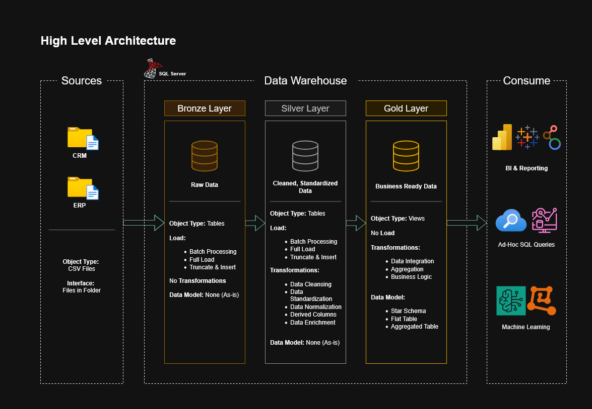

# 🏛️ SQL Data Warehouse & Analytics Project

<div align="center">


**A production-grade SQL data warehouse built on Medallion Architecture — consolidating fragmented data sources into a single, reliable foundation for analytics and reporting.**

[📊 View Datasets](datasets/) • [📋 Project Roadmap](https://www.notion.so/Data-Warehouse-Project-Planning-36da8013e4188073b18ee2d90beb6c78?source=copy_link) • [🌐 My Website](https://ranjith.website)

</div>

---

## 📌 Overview

This project implements a modern **SQL-based data warehouse** using **Microsoft SQL Server**, following the **Medallion Architecture** (Bronze → Silver → Gold) to unify ERP and CRM data sources into a clean, analytics-ready repository.

Key capabilities include:
- **Automated ETL pipelines** for ingestion, transformation, and loading
- **Star schema data modeling** optimized for high-performance analytical queries
- **SQL-based reporting** for actionable business insights
- Built with **data governance, quality, and compliance** best practices at every layer

---

## 🏗️ Data Architecture

The warehouse is structured across three layers of the **Medallion Architecture**:



| Layer | Purpose |
|-------|---------|
| 🥉 **Bronze** | Raw data ingested as-is from CSV source files into SQL Server — no transformations applied |
| 🥈 **Silver** | Cleansed, standardized, and normalized data — prepared and validated for analytical use |
| 🥇 **Gold** | Business-ready data modeled into a **star schema** — optimized for reporting and dashboards |

---

## 📖 What's Inside

This project covers the full data engineering lifecycle:

1. **Data Architecture** — Medallion-based warehouse design with clearly separated concerns per layer
2. **ETL Pipelines** — Extraction, transformation, and loading scripts from raw sources to analytical models
3. **Data Modeling** — Fact and dimension tables structured for efficient querying and reporting
4. **Analytics & Reporting** — SQL-driven insights ready for BI tools and stakeholder dashboards

---

## 🚀 Project Requirements

### Objective
Develop a modern SQL Server data warehouse to consolidate sales data from multiple systems, enabling reliable analytical reporting and data-informed decision-making.

### Specifications

| Area | Details |
|------|---------|
| **Data Sources** | ERP and CRM systems provided as CSV files |
| **Data Quality** | All quality issues identified and resolved prior to analysis |
| **Integration** | Unified data model combining both sources for cross-functional analytics |
| **Scope** | Latest dataset snapshot; historical versioning out of scope |
| **Documentation** | Full data catalog, naming conventions, and model documentation included |

---

## 🛠️ Tools & Resources

> Everything used in this project is **free and open source**.

| Tool | Purpose |
|------|---------|
| [📁 Datasets](datasets/) | Raw ERP & CRM CSV source files |
| [📋 Notion Project Board](https://www.notion.so/Data-Warehouse-Project-Planning-36da8013e4188073b18ee2d90beb6c78?source=copy_link) | Full project phases, tasks, and progress tracking |
| [🗄️ SQL Server Express](https://www.microsoft.com/en-us/sql-server/sql-server-downloads) | Lightweight SQL Server for local database hosting |
| [🖥️ SSMS](https://learn.microsoft.com/en-us/sql/ssms/download-sql-server-management-studio-ssms?view=sql-server-ver16) | GUI for database management and query execution |
| [✏️ DrawIO](https://www.drawio.com/) | Architecture diagrams, data flow, and model design |

---

## 📂 Repository Structure

```
data-warehouse-project/
│
├── datasets/                           # Raw source datasets (ERP and CRM CSV files)
│
├── docs/                               # Architecture diagrams and project documentation
│   ├── data_architecture.drawio        # Overall warehouse architecture diagram
│   ├── data_flow.drawio                # End-to-end data flow across all layers
│   ├── data_models.drawio              # Star schema and dimensional model design
│   ├── etl.drawio                      # ETL techniques and transformation methods
│   ├── data_catalog.md                 # Field descriptions, metadata, and data dictionary
│   └── naming-conventions.md           # Naming standards for tables, columns, and files
│
├── scripts/                            # SQL scripts organized by layer
│   ├── bronze/                         # Raw data extraction and loading scripts
│   ├── silver/                         # Data cleansing and transformation scripts
│   └── gold/                           # Analytical model and star schema scripts
│
├── tests/                              # Data quality checks and validation scripts
│
├── README.md                           # Project overview and setup guide
├── LICENSE                             # MIT License
├── .gitignore                          # Git ignored files and directories
└── requirements.txt                    # Project dependencies
```

---

## 🛡️ License

This project is licensed under the [MIT License](LICENSE). You are free to use, modify, and distribute it with proper attribution.

---

## 🌟 About Me

Hi there! I'm **Ranjith Ankilla** — a Data Engineer and IT professional with **5 years of experience** building data systems that drive real business outcomes.

I specialize in designing, building, and optimizing large-scale **Data Pipelines**, **ETL processes**, **SQL-based warehousing**, and **BI dashboards** that transform raw data into decisions. I bring both technical depth and a sharp business mindset to every project.

<br/>

[](https://linkedin.com/in/ankilla)
[](https://ranjith.website)
[](mailto:ranjith.ankilla@gmail.com)
